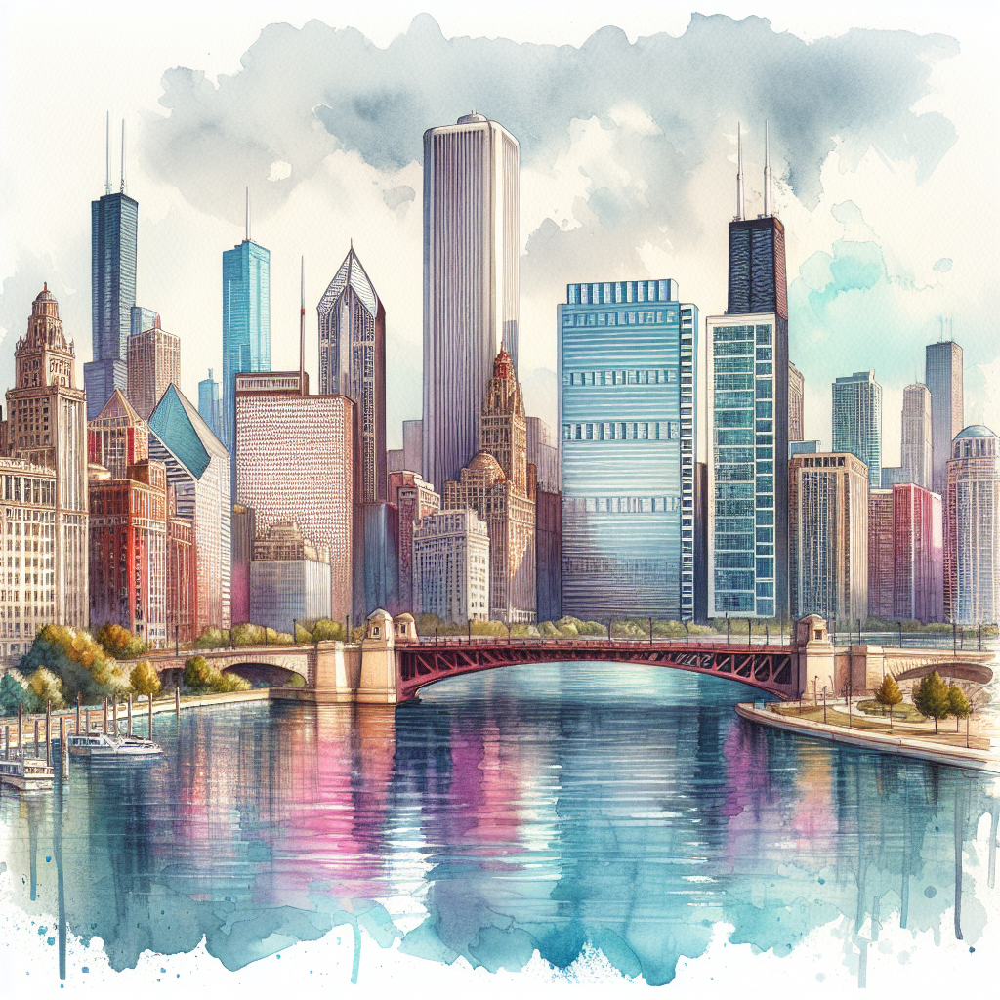
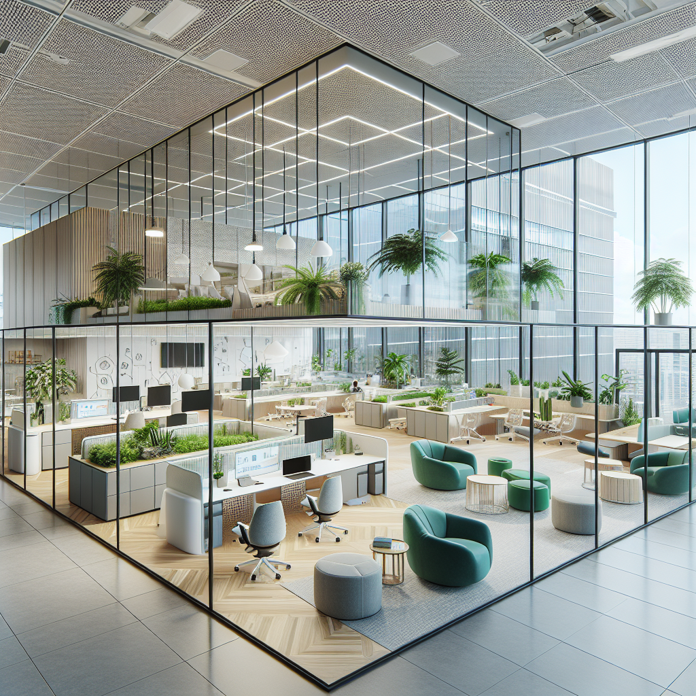

# Part 3: Image Generation

Welcome to part 3 of this workshop, where we will interact with a text-to-image model, DALL-E 3. 

> [!TIP]
> What is DALL-E 3? DALL-E 3 is a neural network based model that can generate graphical data from **natural language input**. Put more simply, you can provide DALL-E 3 with a **description** and it can generate an appropriate image.

## Creating your first images

To create your first image, follow the following steps:


1. Navigate to the  **playgrounds**, on the left-hand navigation bar, and select **Try the Image Playground**
2. In the Images playground, find and click on the drop-down menu labeled **Deployments**. From the drop-down list, select **dall-e-3**.
3. In the Images playground, find the text box labeled _"Describe the image you want to create."
4. After typing your message, a **Generate** button will appear. Click the button submit your image description to the model deployment.
5. After sending your query, wait a moment for the model to process and respond. The response will appear in the window below your input.

Let's begin with generating an image by entering a basic prompt in the description box, then clicking on generate:


```a watercolor painting of Chicago skyline```


This will generate something like the following:



Images generated by DALL-E 3 are original; they are not retrieved from a curated image catalog. In other words, DALL-E 3 is not a search system for finding appropriate images - it is an artificial intelligence (AI) model that generates new images based on the data on which it was trained.

### Be specific

Details allow for more accurate responses. Similar to text generation, image generation models benefit greatly from detailed descriptions of what you want to generate.

1. For example, enter the following prompt:

    ```A logo for an adventure brand```

2. Then select **Generate** and view the image that is generated.

    

3. Now, let's modify the prompt by adding more details to the description:


    ```A logo combining a tent silhouette and stars, with a rustic feel for an adventure brand.```

4. Select **Generate** once again and compare the results.

    

### Best practices

To create effective and accurate images with DALL-E 3, here are some best practices to follow:

1. **Clear and descriptive prompts**: Craft your text prompts to be clear and detailed. The more specific you are with your description, the more likely DALL-E 3 will generate an image that matches your request. Include attributes such as the subject, action, environment, style, and any important details.

1. **Use of adjectives**: Employ adjectives and adverbs to describe the qualities, emotions, and characteristics you want the image to convey. This helps in refining the generated image to better match your vision.

1. **Balance detail with simplicity**: While details are important, overly complicated or contradictory prompts can confuse the AI, leading to unexpected results. Aim for a balance where your description provides enough context without being overly convoluted.

1. **Experiment with different styles**: Specify artistic styles or influences if you want your image to have a particular aesthetic. For example, you could ask for an artistic image.

1. **Iterative approach**: Often, the first image generated may not be perfect. Use it as a starting point and iteratively refine your prompt based on the output to get closer to your desired result.

1. **Aspect ratio and composition**: If you have a preference for the image's composition or aspect ratio, include it in your prompt. For example, you might request a landscape-oriented image or a portrait with a subject off-center.

1. **Cultural and contextual references**: If appropriate, include cultural or historical references to provide additional context that can help guide the image generation process.

1. **Responsible AI considerations**: Be mindful of the Responsible AI implications of your prompts. Avoid creating images that are offensive, perpetuate stereotypes, or infringe on copyrights.

1. **Testing and learning**: Experiment with different prompts to understand how DALL-E 3 interprets various descriptions. This learning process can help you improve the precision of your prompts over time.

1. **Following guidelines**: Adhere to OpenAI's use-case policy and content guidelines when creating prompts. Avoid requesting images that are not allowed as per OpenAI's content policy.

## Brand Mascot Creation

For this workshop, we will leverage the capabilities of DALL-E 3 to generate images for a brand mascot, focusing on different themes such as friendly animals, robots, or abstract figures. 

We will also test different DALL-E 3 parameters to explore the versatility of the generated images. These parameters include:

- **Image Size:** Experiment with different sizes (e.g., square, landscape, portrait) to understand how image dimensions impact the design and usability of the mascot in various campaigns.
- **Image style:** Experiment with different styles, such as natural or vivid, to see which aligns best with the brand's personality.
- **Image quality:** Adjust the quality settings to generate high-resolution images suitable for print versus lower-resolution versions for web or social media use. The sizes can be either HD or standard.

1. Let's begin by generating a brand mascot. Consider prompts like:

```A friendly robot mascot with a smiling face, designed in a cartoon style.```


```A playful fox mascot with a colorful scarf, representing agility and creativity.```

```An abstract figure with geometric shapes, conveying innovation and technology.```

2. In the playground, right under the prompt box, you'll find the size, style and quality configurations. Click on each icon to update settings.
3. Try the prompts again with the updated settings. 

## Advanced Prompting

Now that we have seen some basic prompts, let's try something new.

>[!alert] Make sure the System Message is Empty. You can simply click on **Reset to Default** if needed.

We are now going to try to generate an image based on a prompt generated by gpt-4o-mini.

1. Navigate back to the **Chat Playground**.

1. Ensure you have **gpt4o-mini** selected as deployment option.

1. Under **System message** erase the existing message next to the **Give the model instructions and context** to reset the system message back to default.

1. In the **prompt box** add a thorough description of the product we want to create an image for and submit your request to the model.

```
Generate a prompt for DALL-E 3 from this product description:

The 3D Animated Office Space Design by CreativeSpaces offers a modern, interactive representation of a professional work environment. This design concept includes ergonomic furniture, open and collaborative workspaces, greenery for a touch of nature, and large windows to maximize natural light. The layout also incorporates meeting pods, hot desks, and breakout areas for different work modes. The office has a neutral color palette, with accents of green and blue to create a calming yet productive atmosphere.

The 3D Animated Office Space Design is intended for use by architects, interior designers, and companies looking to revamp their workspaces. It highlights the importance of balancing privacy with collaboration, including quiet zones for focused work and shared areas for team interactions. The space features modern materials like glass and wood, combined with innovative lighting solutions to enhance productivity and employee well-being.

Beyond its aesthetic appeal, the 3D Animated Office Space Design is designed with functionality in mind. It includes ample storage solutions, acoustic panels to reduce noise, and modular furniture that can be rearranged to suit different needs. The green walls and potted plants throughout the office create a refreshing environment that promotes creativity and reduces stress. The design is presented in a high-quality 3D animation, providing a realistic walkthrough that allows clients to visualize the space effectively.
```

2. Once you get the response, click on the three dots at the top of the response and click on **Copy response to clipboard**.


3. Navigate back to the **Images playground** to generate an image from the prompt response.

4. In the Images playground, **ensure that 'dall-e-3' is selected under Deployments**, then paste the generated prompt into the **Prompt Box**.

5. Click **Generate** and notice how detailed the image comes out to be.



## Next steps

Congratulations! You have now completed the third part of the lab, and have generated the necessary image assets for the Contoso Outdoors Company e-commerce website. In the next part of the lab, you will learn how to use the model for multimodal requests.

Move to [Part 4: Multimodality](./05_Multimodal_Interfaces.md)